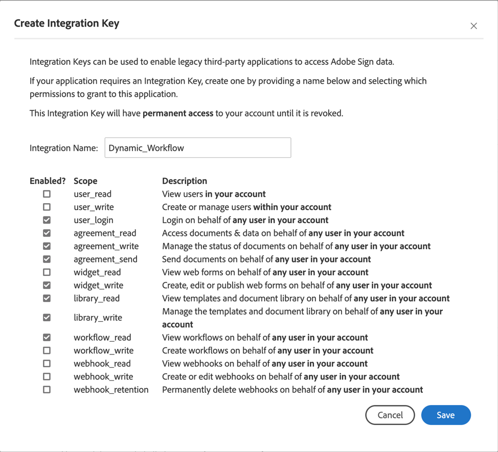

# Dynamic Workflow
Dynamic Workflow built on top of express using Adobe Sign API.


## Overview
Dynamic workflows allow users to specify the next participants within an agreement.

## Disclaimer
There is a known issue that has been submitted to JIRA for participant groups. The feature is currently there, but the functionality has a bug. Once this issue is resolved, a patch will be issued out.

## Features
| Features | Description |
| --- | --- |
| Dynamic Routing | Allows user to provide the next participant associated with the workflow. |
| Hide All Workflow w/ Predefined Recipients | Allows the application to hide workflows with predefined recipients. |
| Hide Target Workflows w/ Predefined Recipients | Specify which workflows you want to only hide predefined recipients. |
| CSS Theme | Easily change the theme by adjusting CSS variables |
| Sender Input Fields | Allow workflow sender input fields to be replicated over into the form. |
| Upload Documents | Allow the sender to upload additional documents if enabled in workflow. |
| Recipient Groups | Allows you to have the ability to dynamically route to recipient groups.  *As of version 1.1, this feature is blocked please see disclaimer.* |

## Deployment Instructions
This is a server-side version of the Dynamic Workflow application. You must host and deploy this application for it to work. There are many methods of deploying an application. In this example, I will be deploying it to Digital Ocean. Feel free to choose whichever platform/services and use this documentation as a guideline.

### Digital Ocean
1. Click create and select droplet
2. Choose an image. We will be going with Ubuntu 18.04.3 LTS x64
3. Choose a plan that best fits your business needs. For demo purposes, I will be choosing a Standard plan at $5/mo
4. Select your preferred datacenter region
5. Select any additional options
6. Choose an SSH for the authentication method
7. Create an SSH key for your droplet
8. Choose a hostname
9. Click create droplet
10. SSH into your server

### Node.js
```sh
# Refresh your local package index with the following command
sudo apt update

# Install Node.js from repositories
sudo apt install nodejs

# Install node packaging manager
sudo apt install npm
```

### Importing Source File
There are two options to import your source file.  Git or FTP.
1. **Git:** In the appropriate dir, execute `git clone {url_to_repo}`
2. **FTP:** You can use whichever tool you prefer tool, like [Cyberduck](https://cyberduck.io/).

### Install Dependencies

You will need to install all dependencies associated with this application
```sh
cd dynamic-workflow
npm install
```

### Installing nodemon
Use nodemon as a dev node on production. *We will use pm2 as our process manager*

```sh
npm install -g nodemon
npm start dev # Use only for development
```

### Default port 80
To run application on default port 80 install lib2cap-bin
```sh
sudo apt-get install lib2cap-bin
sudo setcap cap/net/bind/service=+ep `readlink -f \`which node\``
```

### Install pm2
Install pm2 to and run application in the background
```sh
npm install pm2 -g
pm2 start ~/Dynamic/Workflow/server/server.js
```

## Configuration
There is a sample env file in the `server` folder, `.env.dist`, that needs to be copied to `.env` and modified for your environment.

There are three main components within the configuration file.

### Server
- `host`: The host address to your Sign Console.
- `endpoint`: This is the API endpoint

### Enterprise
- `integration`:   This is your integration key for Adobe Sign. Please see the integration key section.

### Features
- `REACT_APP_ALL_MAX_SUBMITS`: This will determine the amount of submissions for ALL workflows combined.
- `REACT_APP_MAX_SUBMITS`: This will determine the amount of submissions for a workflow. 
- `REACT_APP_HIDE_SELECTOR`: This turn on the feature to hide the workflow selector and use direct url links only.
  - `true`: Turn on
  - `false`: Turn off
- `REACT_APP_HIDE_PREDEFINED_RECIPIENT`: This turns on the feature to hide predefined recipients in your workflow.
  - `true`: Turn on
  - `false`: Turn off
- `REACT_APP_HIDE_PREDEFINED_RECIPIENT_WORKFLOW_LIST`: A list to target specific workflows to hide predefined recipients separating with commas.
- `REACT_APP_HIDE_PREDEFINED_CC`: This turns on the feature to hide predefined ccs in your workflow.
  - `true`: Turn on
  - `false`: Turn off
- `REACT_APP_HIDE_PREDEFINED_CC_WORKFLOW_LIST`: A list to target specific workflows to hide predefined ccs separating with commas.

#### Direct URL Link Parameters
List the parameter values in order of placement e.g. `recipient=test@gmail.com&recipient=test2@gmail.com`. If there is a predefined field, the item will be filled in the next input field. Each parameter has a specific key:
- Agreement Name: `agreementName`
- Message: `message`
- Recipient Emails: `recipient`
- CC Emails: `cc`
- Merge Field: `field`
- Deadline: `deadline`
  - The deadline date to be signed needs to be formatted: YYYY/MM/DD
- Reminder: `reminder`
  - Options for reminder:
    - Every day: `DAILY_UNTIL_SIGNED`
    - Every week: `WEEKLY_UNTIL_SIGNED`
    - Every business day: `WEEKDAILY_UNTIL_SIGNED`
    - Every other day: `EVERY_OTHER_DAY_UNTIL_SIGNED`
    - Every third day: `EVERY_THIRD_DAY_UNTIL_SIGNED`
    - Every fifth day: `EVERY_FIFTH_DAY_UNTIL_SIGNED`

### Integration Key
You will be required to create an integration key with limited scopes for this application and add the integration key inside the .env file. [Click Me](https://helpx.adobe.com/sign/kb/how-to-create-an-integration-key.html)



### Major Contributors
- https://github.com/sophiastan
- https://github.com/nwcell
- https://github.com/NathanNguyen345

### Contributing
Contributions are welcomed! Read the [Contributing Guide](./.github/CONTRIBUTING.md) for more information.

### Licensing
This project is licensed under the Apache V2 License. See [LICENSE](LICENSE) for more information.
